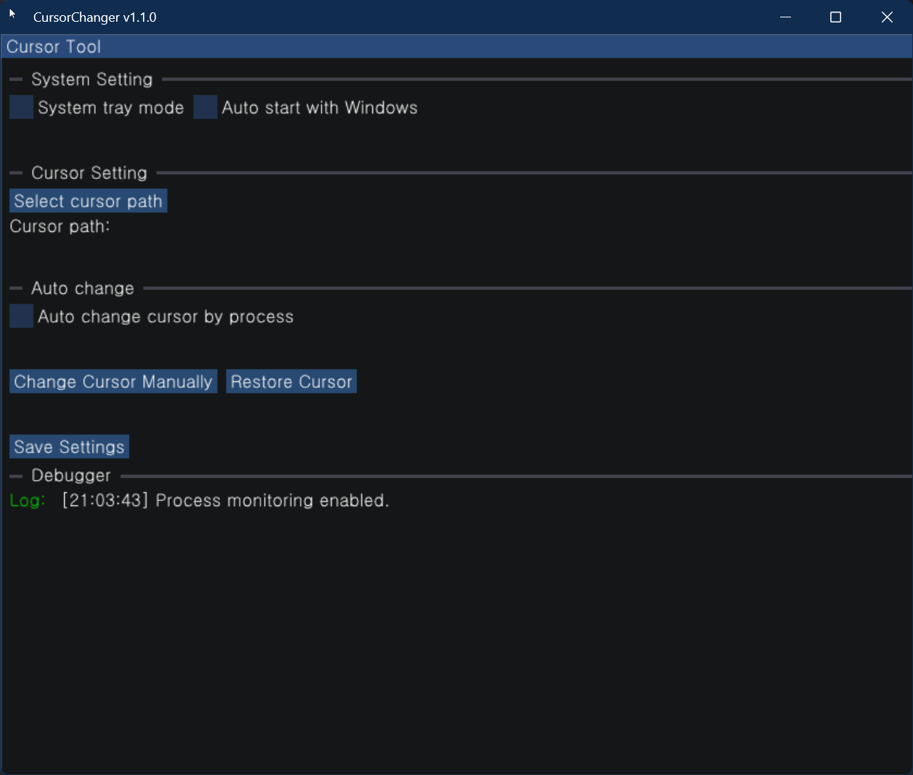

<p align="left">
  <a href="#English">English</a> | <a href="#한국어">한국어</a>
</p>

# English
[](https://github.com/ArshesSH/CursorChanger/releases)

# CursorChanger

CursorChanger is a Windows desktop utility that automatically changes the mouse cursor based on the active or running process. It is built with Dear ImGui and uses DirectX 12.

## Features


- Change the default system cursor to a specified cursor file (`.cur`, `.ani`)
- Manual cursor change or automatic change based on a target process
- Focus mode: only change the cursor when a specified process window is active
- System tray integration with configurable options
- Register/unregister as a startup program
- Save and auto-load your settings

## Getting Started

### Prerequisites

- Windows 10 or later  
- Visual Studio 2019/2022 or a compatible C++ compiler  
- GPU with DirectX 12 support  

### Usage

1. Run the built executable.  
2. Select a cursor file and apply the manual change.  
3. To enable automatic changes based on a process, turn on the “Auto Change” feature and enter the target process name.  
4. Enable “Focus Mode” to restrict cursor changes only when the target process window is in focus.  
5. To register the program to start with Windows, check the startup option in settings. To remove it, uncheck that option and save, or run `UnregisterStartup.bat`.

### Building from Source

1. Clone the repository:
   ```bash
   git clone https://github.com/ArshesSH/CursorChanger.git
2. Open the solution in Visual Studio.
3. Build the solution in Release or Debug mode.

## Configuration

Settings are automatically saved in the same folder as the executable. You can edit them via the in-app GUI or with any text editor.

## License

MIT License. See [LICENSE](LICENSE) for details.

---

# 한국어

[](https://github.com/ArshesSH/CursorChanger/releases)

# CursorChanger

CursorChanger는 활성 또는 실행 중인 프로세스에 따라 마우스 커서를 자동으로 변경해주는 Windows 데스크탑 유틸리티입니다.
Dear ImGui로 작성되었으며, DirectX12를 사용합니다.

## 주요 기능
  

- 기본 마우스 커서를 지정한 커서 파일(.cur, .ani)로 변경
- 수동 변경 또는 프로세스에 따른 자동 변경 가능
- 포커스 기능: 특정 프로세스가 활성화 되었을 때만 커서 변경
- 시스템 트레이 설정 옵션
- 시작 프로그램 등록 기능
- 설정 저장 및 자동불러오기
  

## 시작하기

### 필요 조건

- Windows 10 이상
- Visual Studio 2019/2022 또는 호환되는 C++ 컴파일러
- DirectX 12 지원 GPU

### 사용법

1. 빌드된 실행 파일을 실행합니다.
2. 커서파일을 지정하고 수동으로 변경합니다.
3. 프로세스에 따라 저장하려면 자동 변경 기능을 활성화 하고, 대상 프로세스명을 입력합니다.
4. 포커스 기능을 활성화 하여, 대상 프로세스를 보고있을 때만 사용가능하도록 설정할 수 있습니다.
5. 시작 프로그램 등록 시, 레지스트리에 시작프로그램이 등록됩니다. 프로그램을 삭제하는 경우 옵션을 체크해제한 후 저장하거나, UnregisterStartup.bat을 이용해 삭제해주세요.

### 빌드 방법
1. 저장소를 클론합니다: https://github.com/ArshesSH/CursorChanger.git
2. Visual Studio에서 솔루션을 엽니다.
3. Release 또는 Debug 모드로 빌드합니다.


## 설정

설정은 실행 파일이 위치한 폴더에 자동 저장됩니다. 프로그램 내부 GUI를 통해 설정을 편집할 수 있으며, 별도의 편집기를 사용해도 상관없습니다.

## 라이선스

MIT 라이선스. 자세한 내용은 [LICENSE](LICENSE) 파일을 참고하세요.
